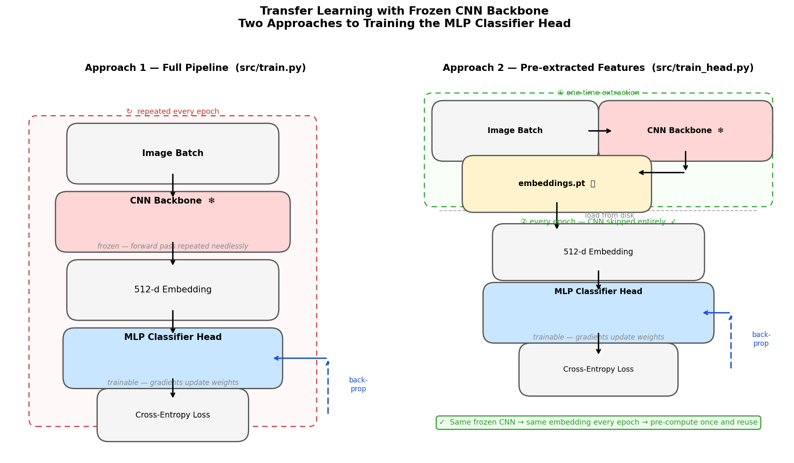

# ResNet Face Classification

A PyTorch implementation of a ResNet18-based face classifier, built as part of
CMU 11-785 (Introduction to Deep Learning) HW2P2. The project explores the training efficiency using pre-extracted CNN features for training a classifier.


## Overview

The model classifies face images into 7,001 identities using a frozen ResNet18
backbone with a trainable MLP classifier head. The core research question:

> **Does pre-extracting CNN embeddings once (instead of re-running the backbone
> every epoch) cost accuracy — and is any accuracy loss worth the training
> speedup?**

## Results

| Approach | Val Top-1 | Val Top-5 | Total Training Time |
|---|---|---|---|
| Full pipeline (CNN + MLP, live augmentation) | 83.71% | 90.12% | ~241 min |
| MLP-only (pre-extracted features, Head B) | 83.29% | 90.02% | ~73 min |
| **Accuracy gap** | **0.42 pp** | **0.10 pp** | **70% faster** |

The MLP-only approach reaches within 0.42 pp of the full pipeline at a fraction
of the compute cost, making it the clear winner for hyperparameter sweeps.

## How It Works

When the CNN backbone is frozen, it produces the same embedding for every image
every epoch — making the backbone forward pass pure wasted compute. Instead, we
pre-extract embeddings once, save them to disk, and train only the MLP head on
those fixed features.



## Project Structure

```
src/
  model.py          # ResNet18, MLPHead, HEAD_CONFIGS, backbone helpers
  train.py          # Full pipeline training script (SageMaker-compatible)
  train_head.py     # MLP-only training on pre-extracted features

scripts/
  build_and_push_ecr.sh           # Build Docker image and push to ECR
  upload_data_to_s3.sh            # Upload dataset to S3
  extract_and_upload_features.py  # Pre-extract CNN embeddings, upload to S3
  launch_sagemaker_job.py         # Launch full pipeline job on SageMaker
  launch_sagemaker_MLP_job.py     # Launch MLP-only job on SageMaker
  evaluate_s3_model.py            # Evaluate a model downloaded from S3

notebooks/
  ResNet Face Classification Implementation on Pytorch.ipynb  # Original implementation
  compare_model_training.ipynb    # Full pipeline vs MLP-only comparison

docker/
  Dockerfile        # SageMaker-compatible training image
```

## Setup

**Prerequisites:** Python 3.10+, PyTorch, AWS CLI configured


## Running Experiments

**Pre-extract features (once):**
```bash
python scripts/extract_and_upload_features.py \
    --checkpoint checkpoints/checkpoint.pth \
    --bucket $AWS_BUCKET
```

**Train MLP head on pre-extracted features:**
```bash
python src/train_head.py \
    --train-dir data/features/train_aug5.pt \
    --val-dir data/features/val.pt \
    --head-config B --stage 2 --epochs 8
```

**Launch on SageMaker:**
```bash
python scripts/launch_sagemaker_MLP_job.py \
    --head-config B --stage 2 --epochs 8 --use-spot
```

## MLP Head Configs

| Config | Architecture | Notes |
|---|---|---|
| A | 512 → 7001 | Baseline linear classifier |
| B | 512 → 1024 → 7001 | Best performer |
| C | 512 → 1024 → 512 → 7001 | Two hidden layers |

## Experiment Tracking

All runs logged to WandB (`hw2p2-ablations` project).

## Dataset

CMU 11-785 HW2P2 face classification [kaggle dataset](https://www.kaggle.com/competitions/11-785-f23-hw2p2-classification/data)
